# Contributors
1) Nived Damodaran
2) Sai Harsha Mupparaju

# ros2-rag
A RAG System for ROS2 Robotics using Pytorch, TF, Keras, MongoDB, Qdrant and ClearML. We use docker containers for the environment setup, with different containers for MongoDB server, QDrant, ClearML and the App. The first step is the ETL Pipeline, where we scrape data from Youtube videos, GitHub repositories and Documentation Web pages. The scraped data is then stored in a MongoDB collection. The next step is Featurization. In this step, we first retrieve the scraped data from the MongoDB collection, clean the text, create embeddings using sentence transformers and store it in a different MongoDB collection. We then retrieve data from this collection and store the embeddings into QDrant Vector Database as well, with the data being the payload. For Inferencing, we first retrieve the query, create an embedding out of it and find top K similar documents using QDrant's Cosine similarity. We pass the original query along with the retrieved documents as context to the LLM which then gives us the output. We have also created a Gradio application, as the user interface. Answers are generated and displayed upon choosing the question from the dropdown.

## Milestones and Screenshots

### Environment and Tooling Milestone
Attaching below the screenshot of the docker containers, There is 1 container each for MongoDB, QDrant and the App. The remaining containers are for clearML, for fileserver, API server and web host.
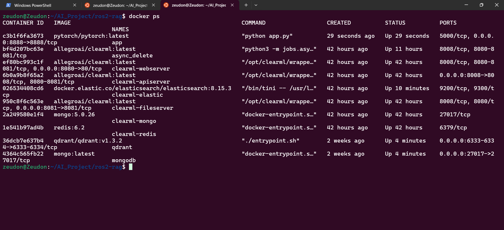

### ETL Pipeline
Attached below are screenshots of the ClearML dashboard and pipeline. The last image shows the output when we query all the unique URLs that was ingested (GitHub + Youtube + Web pages)
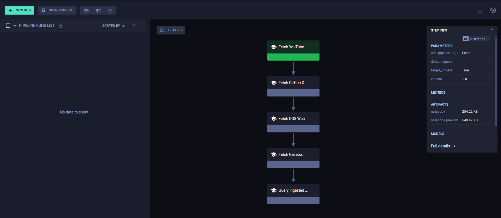
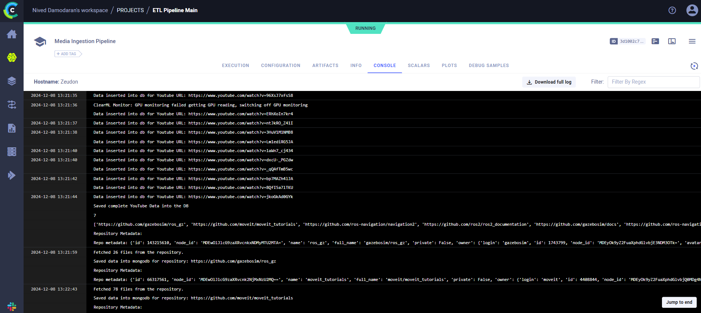
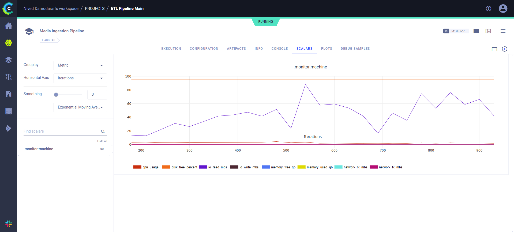
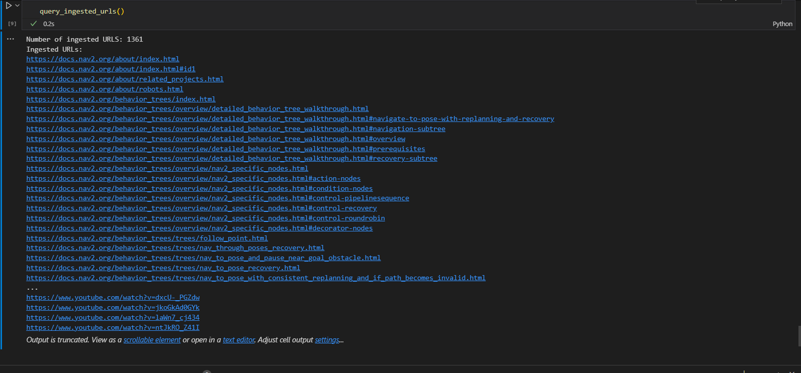
As seen from the image, we have scraped 1361 URLs, that include the unique youtube videos, github repository files and the web pages.

### Featurization Pipeline
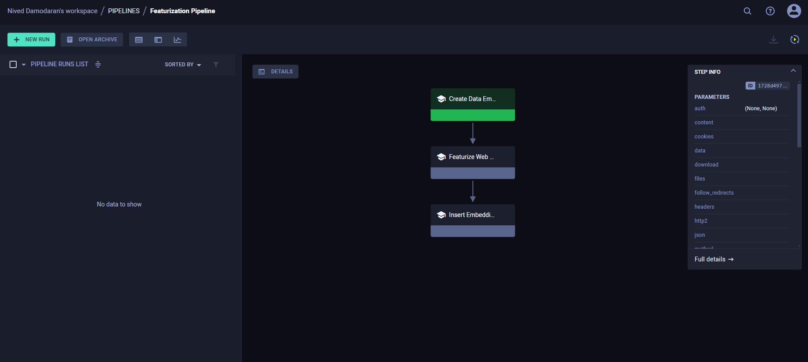

### Output Screenshots

1) Question 1 - Tell me how can I navigate to a specific pose - include replanning aspects in your answer
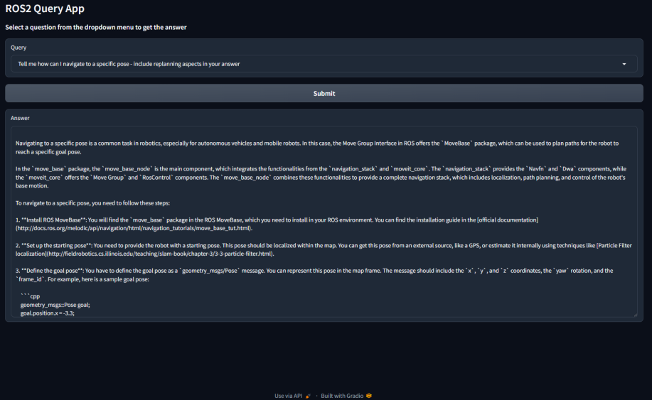
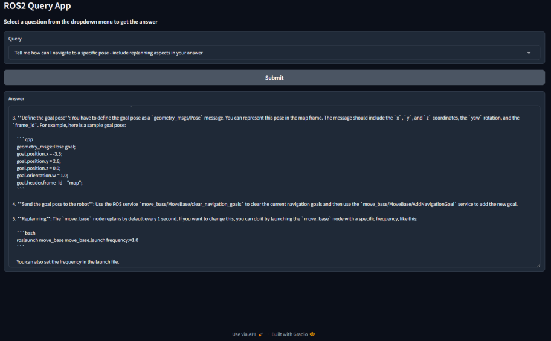
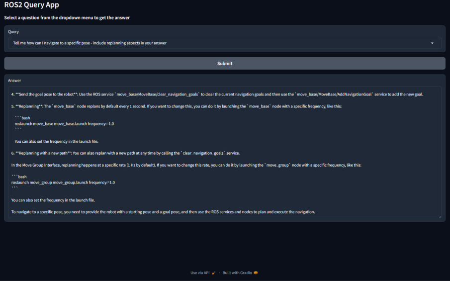

2) Can you provide me with code for this task?
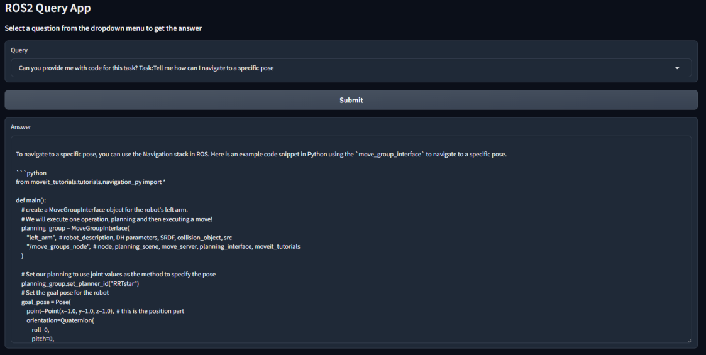
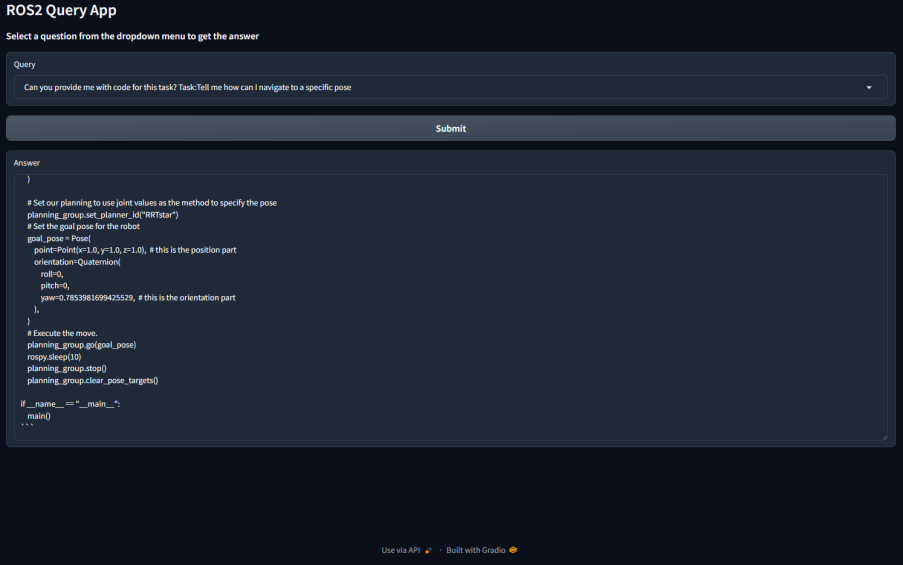

3) Question 3 - Tell me the difference between ROS1 and ROS2
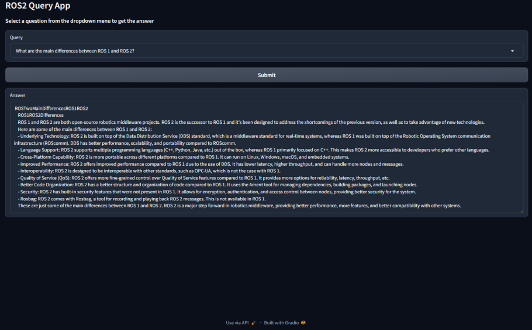

4) Question 4 - What is the purpose of rqt_graph and how can it help in debugging a ROS system?
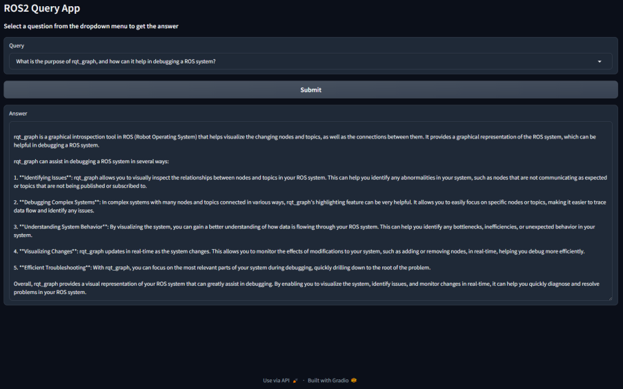

5) Question 5 - What is the function of rviz in ROS?
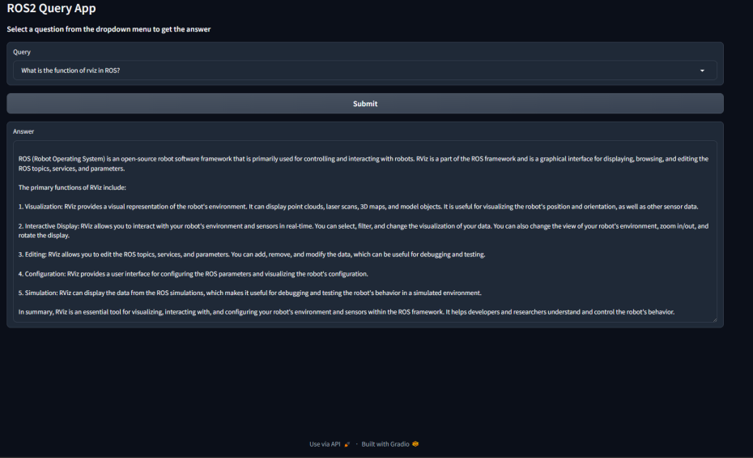
